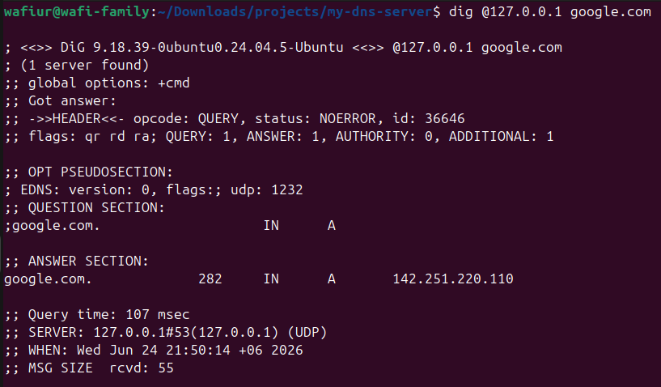

# Containerized Local DNS Server (Technitium)

A locally hosted, containerized DNS server using **Technitium DNS** and **Docker Compose**. This project demonstrates the setup, configuration, and network troubleshooting required to run a private DNS server on an Ubuntu host.

## 🚀 Project Highlights
- **Container Orchestration:** Deployed using Docker Compose for reproducibility.
- **Port Conflict Management:** Successfully resolved port `53` conflicts with `systemd-resolved` and local `dnsmasq` services.
- **Custom Local Domains:** Configured to resolve custom local domains (e.g., `*.local`) for homelab environments.
- **Upstream Forwarding:** Configured with public DNS forwarders (Google `8.8.8.8` / Cloudflare `1.1.1.1`) to resolve external internet traffic.

## 🛠️ Prerequisites
- Docker & Docker Compose
- Ubuntu/Linux host environment

## ⚙️ Installation & Setup

### 1. Free Up Port 53 (Ubuntu)
By default, Ubuntu uses `systemd-resolved` which occupies port `53`. To allow the Docker container to use this port smoothly, disable the stub listener:
```bash
sudo nano /etc/systemd/resolved.conf
# Set DNSStubListener=no
sudo systemctl restart systemd-resolved
sudo ln -sf /run/systemd/resolve/resolv.conf /etc/resolv.conf

```

### 2. Create the Configuration File

Create a new directory and inside it, create a `docker-compose.yml` file:

```bash
mkdir my-dns-server && cd my-dns-server
nano docker-compose.yml

```

Paste the following configuration (note the `127.0.0.1` binding to prevent KVM/dnsmasq conflicts):

```yaml
version: "3"
services:
  dns-server:
    container_name: technitium-dns
    image: technitium/dns-server:latest
    ports:
      - "5380:5380/tcp"           # Web UI
      - "127.0.0.1:53:53/udp"     # DNS UDP
      - "127.0.0.1:53:53/tcp"     # DNS TCP
    environment:
      - DNS_SERVER_DOMAIN=dns-server.local
      - TZ=Asia/Dhaka
    volumes:
      - ./config:/etc/dns
    restart: unless-stopped

```

### 3. Launch the DNS Server

Run the following command to pull the image and start the server:

```bash
sudo docker compose up -d

```

### 4. Access the Dashboard

Open your web browser and navigate to the Technitium web UI:

```text
http://localhost:5380

```

*Set up an admin password upon your first login.*

### 5. Configure Forwarders

To resolve external internet domains, log into the dashboard:

1. Go to **Settings** > **Proxy & Forwarders**.
2. Add `8.8.8.8` or `1.1.1.1` to the **Forwarder Servers** list.
3. Save settings.

## 🧪 Testing the DNS Server

Verify that the server can resolve external domains using `dig`:

```bash
dig @127.0.0.1 google.com

```

*Expected Output: `status: NOERROR` along with the valid IP address in the ANSWER SECTION.*


```

